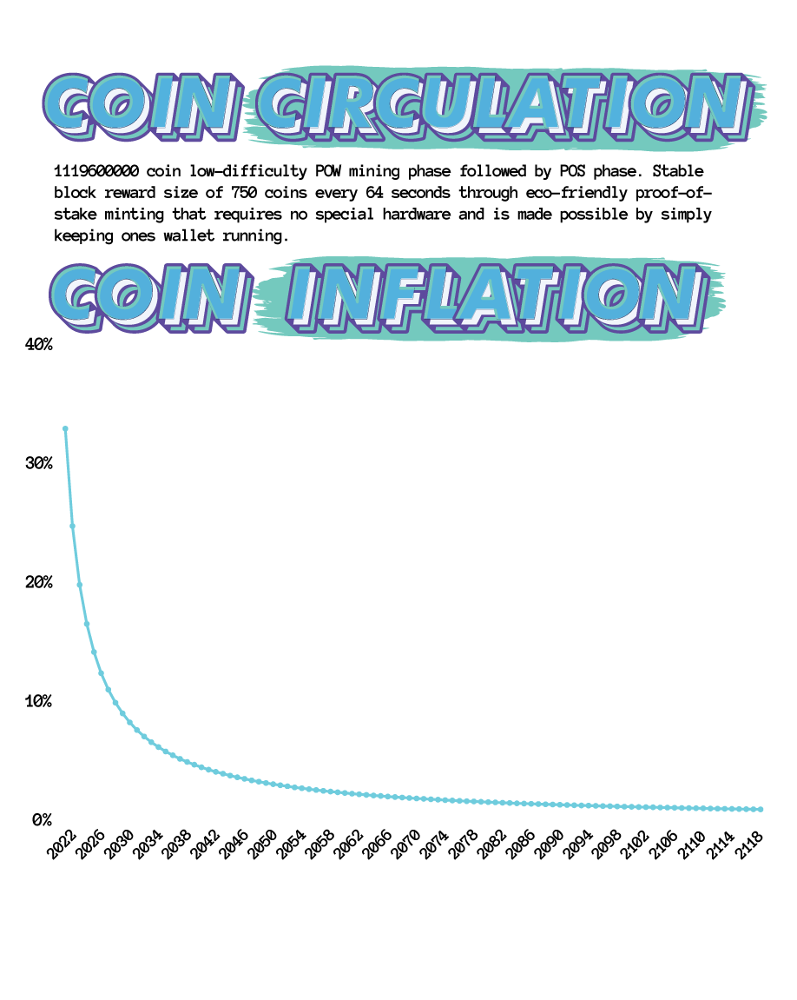

BCMX 1.0.0

--------------

What is BCMX?
--------------

  

[BCMX](https://bcmx.xyz/) is a charitable cryptocurrency that implements the Proof of Stake 3.0 protocol to provide lightning fast, low-friction decentralized transactions on an enviromentally friendly blockchain infrastructure that doesn't require complex mining hardware. 

  

90% of coins directly support the critical mission of funding financial literacy and entrepreneurship programs and contests for K-12 children.

We believe every child should have access to easy-to-digest, fun and foundational information in order to ensure participation in an ever-increasingly financial world. 

Trust
--------------
We utilize layers of trust including both blockchain transparency and traditional audit oversight from a major national accounting firm. 

Minty fresh staking rewards
--------------

  

